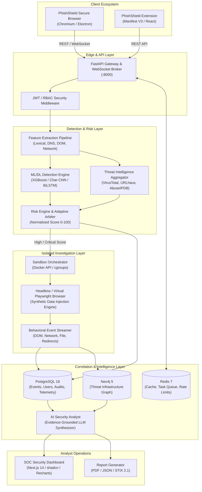

# PhishShield: System Architecture & Data Flow Specification

---

## 1. Architectural Overview

PhishShield employs a decoupled, micro-service-oriented architecture tailored for high-throughput URL inspection, resilient sandboxed execution, and real-time threat graph analysis.



---

## 2. Component Specifications

### 2.1 Edge & API Layer (`backend/app/api`)
- **Technology:** FastAPI (Python 3.11+), Uvicorn, Pydantic V2.
- **Responsibilities:**
  - Ingest URL analysis requests from clients (`/api/v1/scan/url`).
  - Maintain bidirectional WebSockets (`/ws/v1/investigation/{id}`) for streaming live sandbox telemetry (DOM mutations, network waterfall, screenshots) to analyst interfaces.
  - Implement rate limiting, API key quotas, and OAuth2/JWT authentication.

### 2.2 Feature Extraction Pipeline (`backend/app/features`)
- **Lexical Analyzer:** Computes entropy, punctuation frequency, brand keyword distance (Levenshtein against Top 500 banks/tech companies), and TLD risk indices.
- **DNS / RDAP Resolver:** Asynchronously resolves A, AAAA, MX, NS, TXT records; queries RDAP for domain registration timestamp, expiration, and registrar anonymity flags.
- **SSL / TLS Inspector:** Performs SSL socket handshakes to extract issuer, subject alternative names (SANs), validity window, and self-signed status without loading malicious payloads.

### 2.3 ML/DL Detection Engine (`backend/app/ml`)
- **Model Portfolio:**
  - *Lightweight Model:* XGBoost classifier trained on 38 engineered lexical & structural features ($<15\text{ms}$ inference latency).
  - *Deep Sequence Model:* Character-level 1D-CNN + Bidirectional LSTM capturing structural anomalies, sub-word n-grams, and homoglyph tricks directly from raw URL strings without manual feature crafting.
- **Output:** Calibrated probability estimate $P_{\text{threat}} \in [0.0, 1.0]$.

### 2.4 Risk Scoring & Adaptive Decision Engine (`backend/app/risk`)
Computes composite risk through weighted evidence fusion:

```
Risk Score = (0.40 * ML_Probability)
           + (0.20 * Domain_Risk)
           + (0.15 * Infrastructure_Risk)
           + (0.15 * Dynamic_Behavior_Risk)
           + (0.10 * Threat_Intel_Confidence)
```

The output maps to an adaptive routing verdict:
- `ALLOW` ($0 - 30$): Safe to navigate in native browser.
- `WARN` ($31 - 60$): Interstitial warning prompt; requires explicit user override.
- `CONTROLLED` ($61 - 80$): Route to ephemeral client container with synthetic form autofill.
- `ISOLATE` ($81 - 100$): Route to backend headless sandbox; analyst views non-interactive or remote-isolated video stream.

### 2.5 Secure Sandboxing & Behavioral Engine (`backend/app/sandbox`)
- **Execution Environment:** Isolated Linux containers (Docker) running unprivileged Playwright instances.
- **Resource Constraints:** Strict memory limits ($512\text{MB}$), CPU throttling ($0.5\text{ CPU}$), and restricted network bridge with egress logging.
- **Synthetic Data Injection:** Automatically detects password, credit card, phone, and SSN fields via heuristic DOM queries and populates them with synthetic test strings.
- **Telemetry Capture:**
  - Redirect tracker captures full HTTP $301/302/307/meta$-refresh chains.
  - Network logger records all outbound IP addresses, domains, and payload sizes.
  - Dynamic mutation observer detects hidden DOM injections and external script fetches.

### 2.6 Neo4j Threat Graph Layer (`backend/app/graph`)
- **Ontology / Node Schema:**
  - `(:URL {url, hash, first_seen, last_seen})`
  - `(:Domain {name, tld, created_at, registrar})`
  - `(:IP {address, version, country, latitude, longitude})`
  - `(:ASN {asn_number, org_name})`
  - `(:Certificate {thumbprint, issuer, valid_from, valid_to})`
  - `(:Nameserver {host})`
  - `(:Campaign {cluster_id, confidence, tags})`
- **Relationship Schema:**
  - `(u:URL)-[:HOSTED_ON]->(d:Domain)`
  - `(d:Domain)-[:RESOLVES_TO]->(i:IP)`
  - `(i:IP)-[:BELONGS_TO]->(a:ASN)`
  - `(d:Domain)-[:USES_CERT]->(c:Certificate)`
  - `(d:Domain)-[:USES_NS]->(ns:Nameserver)`
  - `(u:URL)-[:PART_OF]->(camp:Campaign)`

### 2.7 AI Security Analyst Engine (`backend/app/analyst`)
- Ingests structured JSON telemetry from sandbox, ML engine, and Neo4j sub-graphs.
- Queries a local or private LLM with an evidence-grounding prompt template.
- Outputs structured investigation briefs strictly separating verified telemetry from analytical deductions:
  ```json
  {
    "verdict": "CRITICAL_PHISHING",
    "observed": [
      "Target URL submitted credential POST request to external host: 'http://185.220.101.5/auth/collect.php'",
      "Page cloned Microsoft 365 login branding with 98.4% structural DOM similarity",
      "SSL Certificate issued 2 hours prior to scan by Let's Encrypt"
    ],
    "inferred": [
      "Active credential harvesting campaign targeting enterprise O365 users",
      "Infrastructure overlaps with known bulletproof hosting cluster AS202425"
    ],
    "unknown": [
      "Actor attribution or campaign operator identity remains unconfirmed"
    ],
    "remediation": [
      "Block domain *.login-microsoft-security-check.com at perimeter firewall",
      "Revoke session tokens for any corporate user who navigated to URL in last 24 hours"
    ]
  }
  ```

---

## 3. End-to-End Data Flow Pipeline

```
[User / Browser]
       │
       ▼
 1. Intercept URL Event
       │
       ├─────────────────────────────────────────┐
       ▼                                         ▼
 2. Check Local Cache (Redis)           3. Query Threat Feeds (URLhaus, VT)
       │ (Miss)                                  │
       ▼                                         ▼
 4. Extract Real-Time Features (Lexical, DNS, TLS metadata)
       │
       ▼
 5. Execute ML/DL Inference
       │
       ▼
 6. Calculate Composite Risk Score (0 - 100)
       │
       ▼
 7. Adaptive Decision Engine
       │
       ├───────────────────┬──────────────────────┬───────────────────────┐
       ▼                   ▼                      ▼                       ▼
     [LOW]              [MEDIUM]                [HIGH]                [CRITICAL]
  Allow Direct      Render Warning Gate    Route to Ephemeral      Launch Docker Sandbox
   Navigation         in Extension/Client   Container Profile      + Playwright Agent
       │                   │                      │                       │
       └───────────────────┴──────────────────────┴───────────────────────┘
                                                  │
                                                  ▼
                                       8. Behavioral Telemetry Stream
                                          • DOM mutations & forms
                                          • Synthetic data injection
                                          • Network waterfall & exfil
                                                  │
                                                  ▼
                                       9. Knowledge Correlation
                                          • Write timeline to PostgreSQL
                                          • Update Neo4j graph nodes
                                          • Detect shared ASN/IP clusters
                                                  │
                                                  ▼
                                      10. AI Analyst Synthesis
                                          • Partition Observed / Inferred / Unknown
                                          • Generate executive summary
                                                  │
                                                  ▼
                                      11. Analyst Operations
                                          • Live display on SOC Dashboard
                                          • Export PDF / JSON / STIX 2.1 report
```
